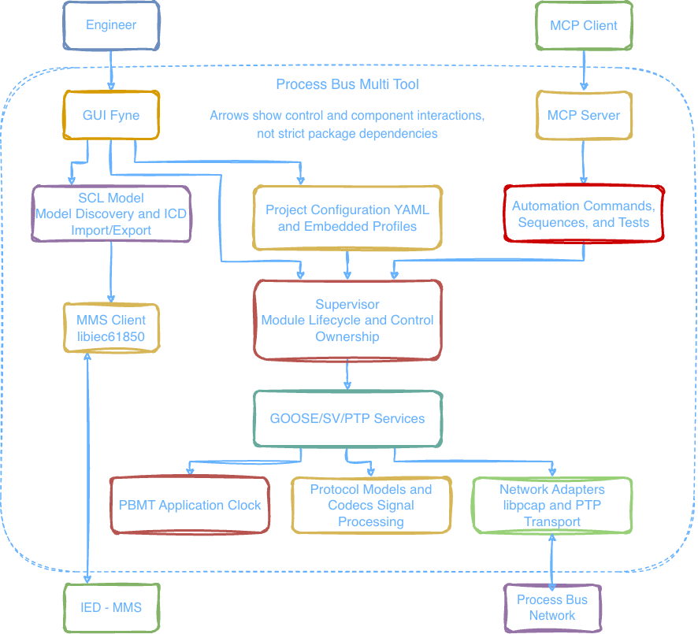
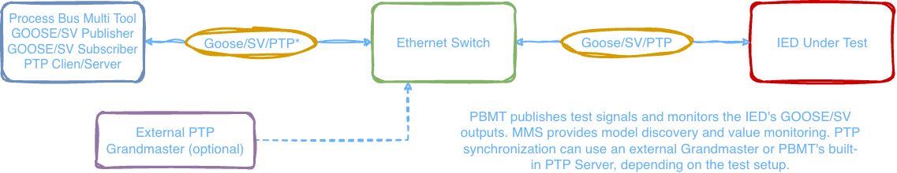

# Process Bus Multi Tool — MCP Tool for IEC 61850 Testing

## Purpose

Process Bus Multi Tool (PBMT) is an MCP-enabled desktop tool for testing IEC 61850 protection and control IEDs. Its built-in Model Context Protocol (MCP) server lets external AI agents and compatible clients read GOOSE/SV signals, control test outputs, run timed sequences, and measure an IED's SV-to-GOOSE response.

The engineer uses the GUI to configure the test setup, verify communication, and start the required modules. The MCP client then operates on the prepared streams, while PBMT handles protocol traffic, sequence timing, and response measurement locally. Manual operation is also available for commissioning, integration, and troubleshooting in Process Bus and Station Bus networks.

## Features

- MCP Server for agent-driven GOOSE/SV monitoring and control, timed sequences, and response-time tests;
- IEC 61850-8-1 GOOSE reception;
- IEC 61850-8-1 GOOSE publication;
- IEC 61850-9-2LE Sampled Values reception;
- IEC 61850-9-2LE Sampled Values publication;
- PTPv2 Client in Default Profile and IEEE C37.238 Power Profile modes;
- PTPv2 Server operating as a forced Grandmaster for laboratory testing;
- online IED model discovery over MMS, live value monitoring, and reconstructed ICD export.

## MCP Workflow

1. **Prepare the IED project:** configure GOOSE/SV streams and any required PTP synchronization in the GUI, then start and verify the modules in **Manual**.
2. **Connect an MCP client:** review the signal catalog, start the MCP Server, and connect to `http://<server-ip>:<port>/mcp` with a Bearer token. See [MCP Server](#mcp-server) for connection details.
3. **Inspect and control signals:** use `get_catalog` and `get_status` to identify the prepared streams, `goose_get` / `sv_get` to read values, and `goose_set` / `sv_set` to apply test outputs.
4. **Run a test:** use `t_set_goose` / `t_set_sv` for timed sequences, or `run_test` to apply SV steps and measure the response to an expected GOOSE edge. Retrieve sequence progress with `get_sequence` and test results with `get_test`.

For example, an agent can request a sequence of current RMS steps and measure the time until the IED asserts a GOOSE trip signal. PBMT executes the test and captures the response locally; the agent retrieves the result through MCP.

MCP control covers prepared GOOSE/SV streams. Project configuration, module startup, and PTP control remain with the engineer. See [MCP.md](MCP.md) for tool parameters, test prerequisites, and timing limits.

## Architecture



The MCP Server connects external agents to PBMT's signal controls, timed sequences, and response-time tests. The GUI supports project preparation and manual operation, while the Supervisor manages module lifecycles and control ownership. GOOSE and SV services share an internal application clock that can be synchronized by PTP. The MMS client provides IED model discovery and live value monitoring.

## Test Setup



An external MCP client controls PBMT, which publishes test signals and monitors the IED's GOOSE/SV outputs. MMS provides model discovery and value monitoring through the GUI. PTP synchronization can use an external Grandmaster or PBMT's built-in PTP Server, depending on the test setup.

## Limitations

* Use PBMT only on an isolated test bench or in a network where PTP, SV, and GOOSE operation is explicitly authorized.

* The PTP Client does not change the computer's system clock. It adjusts only the internal PBMT timescale used by the GOOSE and SV modules.

* In External mode, the PTP Client selects the packet timestamp source automatically: on Linux, it first attempts hardware timestamping and falls back to kernel software timestamps when the hardware transport cannot be initialized. Local mode binds directly to PBMT's PTP Server clock without a network exchange. Local/External source selection is explicit; there is no automatic switching between them.

* The PTP Server is a Grandmaster generator for testing, not a reference time source. It runs only on Linux and only with NIC hardware timestamps. Adapter and driver support, an associated PHC, and an accurate `PTP_SYS_OFFSET_PRECISE` cross-timestamp are mandatory. The Grandmaster obtains the UTC epoch once at startup, then maintains a continuous timescale from `CLOCK_MONOTONIC_RAW` and maps NIC PHC timestamps to it using an affine transformation. System clock changes after startup do not cause a discontinuity in the PTP timescale. Startup fails if any mandatory component is unavailable.

* PTP Event messages from the Client and Server are never assigned a substitute `time.Now()` timestamp. If the transport does not return the required hardware or software timestamp, the exchange fails and no `FollowUp` containing a false timestamp is sent. Protocol timers and PBMT software or virtual clocks are not subject to this restriction.

* SV publication and MCP timed sequences have no hard real-time guarantee. The SV Publisher skips missed sample slots instead of sending a burst of stale frames. MCP response-time tests use software timestamps and include driver/capture delays.

## User Project Structure and Launch

One project represents one physical protection and control IED. The `cfg` directory contains six YAML files, one per GOOSE/SV/PTP module. The project root also holds its log, saved ICD model, and generated MCP catalog:

```text
<project>/
├── cfg/
│   ├── goose_sub.yaml
│   ├── goose_pub.yaml
│   ├── sv_sub.yaml
│   ├── sv_pub.yaml
│   ├── ptp_client.yaml
│   └── ptp_server.yaml
├── <IED-IP>.icd
├── project.log
└── mcp_catalog.json
```

The ICD is present after the model is saved or supplied; the catalog appears when generated. Keep one project ICD in the root. `project.log` is appended when the project is reopened and records module lifecycle events and errors according to **Settings → Log level**; it is not a signal measurement archive. `mcp_catalog.json` describes configured streams and signals, not their current runtime state.

1. Open the **Open Project** tab and navigate to the directory where the project should be stored.
2. Click **Create Project**, enter a name, and wait for the project to load. The template is embedded in the application, so a separate template directory is not required.
3. In the **Configuration** tab, select the actual network interface instead of the placeholder `eth0`, configure the streams, and enable only the required modules (`enabled: true`).
4. Click **Save**. Unknown YAML fields are rejected, and the configuration of enabled modules is validated before the file is replaced atomically.
5. In the **Manual** tab, open a module and click **Start Module**. GOOSE sends its initial frame immediately; SV schedules its first frame at the next whole application-clock second.
6. Running modules stop after the configuration is changed and saved. Start the required modules again to apply the new configuration.

Once the required streams are running and verified, follow the [MCP workflow](#mcp-workflow) to connect an agent and run tests.

## Modules

Configure stream identities and network settings in **Configuration**, then use **Manual** to start, stop, and monitor modules or change Publisher values. Starting a Publisher initiates network transmission; verify the receiving IED's configuration first.

See [DATASHEET.md](DATASHEET.md) for implemented protocol formats, supported profiles, and limitations.

### SCL Model

- In **Configuration → SCL Model**, enter the IED's IP address and MMS port (default `102`), then click **Read Model** to discover its data tree.
- Click **Connect** to monitor values in the tree; visible attributes are polled at a nominal one-second interval. Slow MMS requests or many visible attributes can lengthen the cycle. **Disconnect** stops live monitoring.
- Use **Save ICD** to save the reconstructed model in the project root. The suggested filename is the IED's IP address, for example `10.10.10.10.icd`. The saved project ICD is loaded automatically when the project is opened.
- Online discovery does not recover the complete engineering configuration. The export is a reconstructed ICD, not a replacement for the manufacturer's original file; unsupported objects are omitted.
- MMS access is read-only. Reading report and setting-group configuration does not enable report subscriptions, control commands, or setting changes.

### GOOSE Subscriber

- Configure subscriptions manually or use **Import SCL** to select a publication from an SCL file and fill in the available frame identity fields. Review the interface, filters, and reception policy, then **Save**. SCL does not supply the source MAC address.
- In **Manual**, start the module to view received DataSet values, nested structures/arrays, stream identity, and counters such as `stNum` and `sqNum`.
- Signal names are resolved automatically from the ICD in the project root, not stored in `goose_sub.yaml`. Labels are used only when the received frame matches the expected identity, revision, and structure; otherwise values retain positional `Entry1`, `Entry2`, etc. labels.

### Sampled Values Subscriber

- Configure the receiving interface and stream filters, then start the module in **Manual**.
- Set the expected sampling configuration: 80 or 256 samples per period at 50 or 60 Hz. A nonzero `smpRate` received in the ASDU overrides the configured samples-per-period value; other `smpMod` modes are decoded but are not converted by the measurement service.
- Monitor the eight channels `Ia, Ib, Ic, In, Ua, Ub, Uc, Un`, including RMS, phase angle, frequency, and Quality. **Instant** switches the value column from RMS to instantaneous samples.
- Phase angles are relative to the configured base vector. `KI` and `KU` scale the displayed current and voltage values; they do not change received samples.
- Check synchronization, Simulation, and stream diagnostics when the received values are missing or unexpected.

### GOOSE Publisher

- Configure the publication identity and DataSet entries in **Configuration**, then start the module in **Manual**.
- Edit DataSet values and click **Apply & Send**, or enable **Auto Send** to apply changes automatically. Other entries remain unchanged.
- **Test**, **Simulation**, and Quality settings support explicit test conditions; check that the receiving IED accepts them.
- Use **Export** in the publication's configuration to save an SCL model for configuring the receiving IED.

### Sampled Values Publisher

- Configure the interface and stream identity, then start the module in **Manual**. Each stream has independent channel settings.
- The Publisher supports 80 samples per nominal period: 4000 frames/s at 50 Hz or 4800 frames/s at 60 Hz, with one ASDU per frame. Changing channel waveform frequency does not change this frame rate.
- Set channel RMS in amperes/volts, phase angle in degrees, frequency, and Quality. Valid Manual edits are applied automatically to a running stream.
- Voltage channels `Ua`, `Ub`, and `Uc` represent phase-to-neutral values, not line-to-line voltage. For a balanced system, divide the required line-to-line RMS by `sqrt(3)` before entering the phase RMS.
- Use individual channel settings, balanced three-phase or two-phase modes, symmetrical components, and optional neutral calculation as required.
- Select the synchronization indication to match the actual test setup and the receiving IED's requirements. Declaring a synchronized stream does not itself synchronize clocks.
- Use **Export** in the stream's configuration to save its SCL model.

### PTP Server

- Configure the profile, domain, transport, delay mechanism, UTC offset, and advertised Grandmaster properties before starting the module. For Power Profile, also select the C37.238 version expected by the IED.
- Start in **Manual** on a Linux host with the required hardware timestamping, PHC, and precise cross-timestamp support. There is no software fallback.
- The module operates as a forced laboratory Grandmaster. Monitor its active profile, identities, clock properties, and status in **Manual**.
- When using it as the local time source for PBMT, start **PTP Server first, then PTP Client** with **Source PTP: Local**.

### PTP Client

- Select **Source PTP: Local** or **External** explicitly in **Configuration**. There is no automatic source switching.
- **Local** binds PBMT's application clock directly to its running PTP Server. It does not send PTP requests or measure a network path to that server. If the source is lost, the client enters unsynchronized holdover; restart the client after restoring the server to rebind.
- **External** synchronizes to a network Grandmaster. Configure the interface, profile, domain, transport, and delay mechanism to match the external source; for Power Profile, select the required C37.238 version.
- Power Profile always uses Ethernet and P2P; the application applies these settings automatically.
- In **Manual**, inspect the selected master, synchronization/servo state, offset, mean path delay, and frequency correction in External mode, or local binding status in Local mode.
- Only PBMT's internal application clock is adjusted; the host system clock is unchanged.

### MCP Server

- Prepare and verify the GOOSE/SV streams in Manual, including any required PTP synchronization, before enabling MCP. MCP does not start modules automatically and does not expose PTP control.
- Open the **MCP** tab and review the generated signal catalog. **Refresh Catalog** rebuilds it from the project's saved configuration and ICD.
- Set **Server IP**, **Server Port**, and **Token**, then click **Start MCP**. Connect a compatible client to `http://<server-ip>:<port>/mcp` with `Authorization: Bearer <token>`. If the bind address is `0.0.0.0`, use the host's reachable LAN IP in the client.
- The Token field contains only the token, without `Bearer`. It accepts at least 12 ASCII characters without spaces. **Copy** copies the token; **Regen** generates a new 12-character token while MCP is stopped. Change the shared default before use outside an isolated test bench. HTTP is intended for a trusted test network only.
- While MCP is active, the agent owns GOOSE/SV control and Manual control is locked. **Stop MCP** normally returns control to Manual without stopping Publishers; ordinary sequences retain their last values, while active response-time tests reset their affected channel RMS values to zero. If the reset frame cannot be confirmed, control is revoked and both GOOSE/SV Publishers are stopped. Losing the agent connection also stops GOOSE/SV Publishers.
- The MCP client must keep the GET/SSE stream open and respond to server pings, including while sequences or tests run.
- The agent can read values, change outputs, run timed sequences, and measure an SV-to-GOOSE response inside PBMT. Measurements use software timestamps, not NIC hardware timestamps.

See [MCP.md](./MCP.md) for the available tools, parameters, timing behavior, and limitations.

## License

PBMT is licensed under the [GNU General Public License v3.0](LICENSE).

Third-party components retain their respective licenses. See [Third-Party License Notices](THIRD_PARTY_NOTICES.md) for dependency licenses and distribution requirements.
